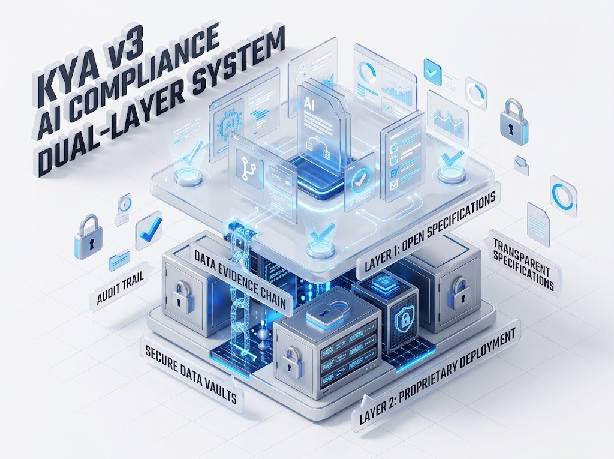
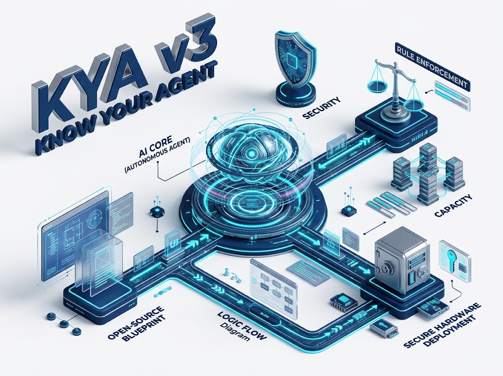

# KYA v3 — Know Your Agent v3

Open specification for agent rights. Proprietary execution.

KYA v3 is open so that anyone can check what an agent is allowed to do. What is not open is how those rights are enforced, how they are proved and who carries the liability. The specification is public; the execution and the evidence are not.

**Agenttien tuntemus auttaa löytämään väärinkäytökset.**
**Murtaja ei tullut ulkoa. Se oli jo sisällä, ja sillä oli oikeudet. Kuka tarkistaa, mitä se sai tehdä?**
→ **KYA v3-spesifikaatio** toimii sisäisen tarkastuksen välineenä.
→ **DWS IQ Aegis** on tuon tarkastuksen väline.
→ [Aegis - Full Sovereignty Layer](https://dws10.com/products/aegis.html)

## What's Open (Apache-2.0)

- Agent permission definitions (`spec/`)
- Access control framework (KYA-defined specification)
- Rights verification protocols (KYA-defined specification for checking an agent's rights, not the implementation)

## Illustrations

| Two layers: open specification, proprietary deployment    | Know Your Agent                                              |
| --------------------------------------------------------- | ------------------------------------------------------------ |
|  |  |

## What's Proprietary (Lifetime Oy)

- **Themis:** Legal reasoning engine (how rights are enforced)
- **Capacity Class:** Where rights may be exercised (deployment constraints: resource limits, capability thresholds, operational boundaries)
- **Aegis:** Full sovereignty layer (execution + compliance evidence chain)

## Limitations of the open specification

An open specification only tells you what an agent may do. It does not tell you what the agent did, and it cannot show that the system enforcing the rights followed the specification. Verify the definition and you have verified the definition; the rest sits in the deployment.

This is not a gap to hide. It is the boundary that makes the specification worth publishing at all. A specification published by the vendor whose enforcement layer is closed is only as good as that vendor's willingness to be checked, so the rule is that the checkable part is open and everything around it is ours.

So the piece holds on both halves. The specification makes the rules checkable. The deployment has to make the enforcement provable, on the customer's own hardware, with the record of each halt, each operator command and each approval signed and kept outside the reach of the party that writes the log. That part is carried by the implementation under the agreement, and responsibility for what happens inside the deployment is the customer's. That is what Aegis is for, and it is why the specification can be open without the enforcement being open.

## Why an open specification

Agent rights must be checkable without trusting the party that built the agent. If you have concerns about what an agent may do, you can verify the rules without involving Lifetime Oy. If you have concerns about how those rules were enforced, or how the evidence was preserved, you rely on the agreement.

Open rules, closed enforcement and a record that outlives both: those three hold together or none of them does. The specification is public; the execution and the evidence are not.

---

**Specification:** https://github.com/blogtheristo/KYA_V3  
**Implementation:** Provided under your agreement with Lifetime Oy

---

The specification is open so that anyone can check what an agent is allowed to do. Whether the enforcement held is answered inside the deployment, in the record it leaves behind, signed and kept outside the reach of whoever writes the log.

---

## Repository layout

| Path                                | Content                                                                 |
| ----------------------------------- | ----------------------------------------------------------------------- |
| `spec/`                             | The open specification (see `spec/README.md` for its publication state) |
| `images/`                           | KYA v3 illustrations                                                    |
| `scripts/check-public-boundary.mjs` | CI check that keeps implementation out of this repository               |

Related open principles: [DWS Vault V1](https://github.com/blogtheristo/DWS_Vault_V1) — how the secrets behind an agent's rights are held.
